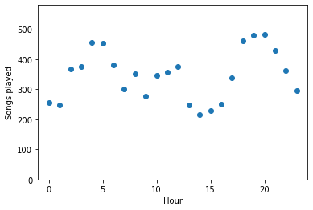

# Song Recommendation with Spark
A Spark project built for recommending songs to users based on their song listening history log files. The project has been realized using Spark and Spark MLlib.
# Song Recommendation

Recommending new songs to users based on user log history


```python
import findspark
import os
```


```python
findspark.init('D:\\Learning\\Spark\\song-recommendation-with-spark\\spark-3.3.1-bin-hadoop3')
```


```python
findspark.find()
```


    'D:\\Learning\\Spark\\song-recommendation-with-spark\\spark-3.3.1-bin-hadoop3'


```python
from pyspark.ml.feature import StringIndexer
from pyspark.sql import SparkSession
from pyspark.sql.functions import udf
from pyspark.sql.types import StringType
from pyspark.sql.types import IntegerType
from pyspark.sql.functions import desc
from pyspark.sql.functions import asc
from pyspark.sql.functions import sum as Fsum
from pyspark.ml.evaluation import RegressionEvaluator
from pyspark.ml.recommendation import ALS
import datetime

import numpy as np
import pandas as pd
%matplotlib inline
import matplotlib.pyplot as plt
```


```python
spark = SparkSession \
    .builder \
    .appName("Song Recommendation project") \
    .getOrCreate()
```


```python
path = "data/sparkify_log_small.json"
user_log = spark.read.json(path)
```

# Data Exploration 

Performing EDA.


```python
user_log.take(5)
```


    [Row(artist='Showaddywaddy', auth='Logged In', firstName='Kenneth', gender='M', itemInSession=112, lastName='Matthews', length=232.93342, level='paid', location='Charlotte-Concord-Gastonia, NC-SC', method='PUT', page='NextSong', registration=1509380319284, sessionId=5132, song='Christmas Tears Will Fall', status=200, ts=1513720872284, userAgent='"Mozilla/5.0 (Windows NT 6.1) AppleWebKit/537.36 (KHTML, like Gecko) Chrome/36.0.1985.125 Safari/537.36"', userId='1046'),
     Row(artist='Lily Allen', auth='Logged In', firstName='Elizabeth', gender='F', itemInSession=7, lastName='Chase', length=195.23873, level='free', location='Shreveport-Bossier City, LA', method='PUT', page='NextSong', registration=1512718541284, sessionId=5027, song='Cheryl Tweedy', status=200, ts=1513720878284, userAgent='"Mozilla/5.0 (Windows NT 6.1) AppleWebKit/537.36 (KHTML, like Gecko) Chrome/36.0.1985.143 Safari/537.36"', userId='1000'),
     Row(artist='Cobra Starship Featuring Leighton Meester', auth='Logged In', firstName='Vera', gender='F', itemInSession=6, lastName='Blackwell', length=196.20526, level='paid', location='Racine, WI', method='PUT', page='NextSong', registration=1499855749284, sessionId=5516, song='Good Girls Go Bad (Feat.Leighton Meester) (Album Version)', status=200, ts=1513720881284, userAgent='"Mozilla/5.0 (Macintosh; Intel Mac OS X 10_9_4) AppleWebKit/537.78.2 (KHTML, like Gecko) Version/7.0.6 Safari/537.78.2"', userId='2219'),
     Row(artist='Alex Smoke', auth='Logged In', firstName='Sophee', gender='F', itemInSession=8, lastName='Barker', length=405.99465, level='paid', location='San Luis Obispo-Paso Robles-Arroyo Grande, CA', method='PUT', page='NextSong', registration=1513009647284, sessionId=2372, song="Don't See The Point", status=200, ts=1513720905284, userAgent='"Mozilla/5.0 (Windows NT 6.1; WOW64) AppleWebKit/537.36 (KHTML, like Gecko) Chrome/36.0.1985.143 Safari/537.36"', userId='2373'),
     Row(artist=None, auth='Logged In', firstName='Jordyn', gender='F', itemInSession=0, lastName='Jones', length=None, level='free', location='Syracuse, NY', method='GET', page='Home', registration=1513648531284, sessionId=1746, song=None, status=200, ts=1513720913284, userAgent='"Mozilla/5.0 (Macintosh; Intel Mac OS X 10_9_4) AppleWebKit/537.36 (KHTML, like Gecko) Chrome/37.0.2062.94 Safari/537.36"', userId='1747')]


```python
user_log.printSchema()
```

    root
     |-- artist: string (nullable = true)
     |-- auth: string (nullable = true)
     |-- firstName: string (nullable = true)
     |-- gender: string (nullable = true)
     |-- itemInSession: long (nullable = true)
     |-- lastName: string (nullable = true)
     |-- length: double (nullable = true)
     |-- level: string (nullable = true)
     |-- location: string (nullable = true)
     |-- method: string (nullable = true)
     |-- page: string (nullable = true)
     |-- registration: long (nullable = true)
     |-- sessionId: long (nullable = true)
     |-- song: string (nullable = true)
     |-- status: long (nullable = true)
     |-- ts: long (nullable = true)
     |-- userAgent: string (nullable = true)
     |-- userId: string (nullable = true)
    
    


```python
user_log.describe("artist").show()
```

    +-------+-----------------+
    |summary|           artist|
    +-------+-----------------+
    |  count|             8347|
    |   mean|            461.0|
    | stddev|            300.0|
    |    min|              !!!|
    |    max|Ólafur Arnalds|
    +-------+-----------------+
    
    


```python
user_log.describe("sessionId").show()
```

    +-------+------------------+
    |summary|         sessionId|
    +-------+------------------+
    |  count|             10000|
    |   mean|         4436.7511|
    | stddev|2043.1281541827561|
    |    min|                 9|
    |    max|              7144|
    +-------+------------------+
    
    


```python
user_log.describe("length").show()
```

    +-------+-----------------+
    |summary|           length|
    +-------+-----------------+
    |  count|             8347|
    |   mean|249.6486587492506|
    | stddev|95.00437130781461|
    |    min|          1.12281|
    |    max|        1806.8371|
    +-------+-----------------+
    
    


```python
user_log.select("page").dropDuplicates().sort("page").show()
```

    +----------------+
    |            page|
    +----------------+
    |           About|
    |       Downgrade|
    |           Error|
    |            Help|
    |            Home|
    |           Login|
    |          Logout|
    |        NextSong|
    |   Save Settings|
    |        Settings|
    |Submit Downgrade|
    |  Submit Upgrade|
    |         Upgrade|
    +----------------+
    
    

# Calculating Statistics by Hour


```python
get_hour = udf(lambda x: datetime.datetime.fromtimestamp(x / 1000.0). hour)
```


```python
user_log = user_log.withColumn("hour", get_hour(user_log.ts))
```


```python
user_log.head()
```


    Row(artist='Showaddywaddy', auth='Logged In', firstName='Kenneth', gender='M', itemInSession=112, lastName='Matthews', length=232.93342, level='paid', location='Charlotte-Concord-Gastonia, NC-SC', method='PUT', page='NextSong', registration=1509380319284, sessionId=5132, song='Christmas Tears Will Fall', status=200, ts=1513720872284, userAgent='"Mozilla/5.0 (Windows NT 6.1) AppleWebKit/537.36 (KHTML, like Gecko) Chrome/36.0.1985.125 Safari/537.36"', userId='1046', hour='2')


```python
songs_in_hour = user_log.filter(user_log.page == "NextSong").groupby(user_log.hour).count().orderBy(user_log.hour.cast("float"))
```


```python
songs_in_hour.show()
```

    +----+-----+
    |hour|count|
    +----+-----+
    |   0|  257|
    |   1|  248|
    |   2|  369|
    |   3|  375|
    |   4|  456|
    |   5|  454|
    |   6|  382|
    |   7|  302|
    |   8|  352|
    |   9|  276|
    |  10|  348|
    |  11|  358|
    |  12|  375|
    |  13|  249|
    |  14|  216|
    |  15|  228|
    |  16|  251|
    |  17|  339|
    |  18|  462|
    |  19|  479|
    +----+-----+
    only showing top 20 rows
    
    


```python
songs_in_hour_pd = songs_in_hour.toPandas()
songs_in_hour_pd.hour = pd.to_numeric(songs_in_hour_pd.hour)
```


```python
plt.scatter(songs_in_hour_pd["hour"], songs_in_hour_pd["count"])
plt.xlim(-1, 24);
plt.ylim(0, 1.2 * max(songs_in_hour_pd["count"]))
plt.xlabel("Hour")
plt.ylabel("Songs played");
```


    

    


# Drop Rows with Missing Values

As you'll see, it turns out there are no missing values in the userID or session columns. But there are userID values that are empty strings.


```python
user_log_valid = user_log.dropna(how = "any", subset = ["userId", 'song'])
```


```python
user_log_valid.count()
```


    8347


```python
user_log.select("userId").dropDuplicates().sort("userId").show()
```

    +------+
    |userId|
    +------+
    |      |
    |    10|
    |   100|
    |  1000|
    |  1003|
    |  1005|
    |  1006|
    |  1017|
    |  1019|
    |  1020|
    |  1022|
    |  1025|
    |  1030|
    |  1035|
    |  1037|
    |   104|
    |  1040|
    |  1042|
    |  1043|
    |  1046|
    +------+
    only showing top 20 rows
    
    


```python
user_log.select("song").dropDuplicates().sort("song").show()
```

    +--------------------+
    |                song|
    +--------------------+
    |                null|
    |                  #1|
    |              $29.00|
    |              & Down|
    |           &And Ever|
    |        ' Cello Song|
    |  '97 Bonnie & Clyde|
    |     'Round Midnight|
    |'Round Midnight (...|
    |    'Till I Collapse|
    |(515) (Album Vers...|
    |(F)lannigan's Bal...|
    |(Hurricane) The F...|
    |(I Love You) For ...|
    |(I've Had) The Ti...|
    |(If You're Wonder...|
    |(Let Me Up) I've ...|
    |        (Nice Dream)|
    |(Not Just) Knee Deep|
    |(Nothing's Too Go...|
    +--------------------+
    only showing top 20 rows
    
    


```python
user_log.select("song").dropDuplicates().sort("song").count()
```


    6126


```python
user_log_valid = user_log_valid.filter(user_log_valid["userId"] != "")
```


```python
user_log_valid = user_log_valid.filter(user_log_valid["song"] != "")
```


```python
user_log_valid.count()
```


    8347


# Transform
Transform dataset into the appropriate format for training MLLib


```python
user_log_valid.select("userId", 'song').dropDuplicates().take(6)
```


    [Row(userId='748', song='Despues'),
     Row(userId='1949', song='Almaz'),
     Row(userId='1077', song='Juego De Seduccion'),
     Row(userId='2449', song='Breakdown'),
     Row(userId='1497', song='Your Song'),
     Row(userId='691', song=None)]


```python
user_song = user_log_valid.select("userId", 'song').dropDuplicates()
```

For denoting user listened to the song, I add a column of 1s


```python
fill = udf(lambda x: 1)
```


```python
user_song = user_song.withColumn("listened", fill(user_song.userId))
```


```python
user_song.count()
```


    8286


```python
user_song.take(5)
```


    [Row(userId='748', song='Despues', listened='1'),
     Row(userId='1949', song='Almaz', listened='1'),
     Row(userId='1077', song='Juego De Seduccion', listened='1'),
     Row(userId='2449', song='Breakdown', listened='1'),
     Row(userId='1497', song='Your Song', listened='1')]


# Casting userID to int

Spark MLLib expects userId to be of type int


```python
user_song.withColumn("userId",user_song.userId.cast("int")).printSchema()
```

    root
     |-- userId: integer (nullable = true)
     |-- song: string (nullable = true)
     |-- listened: string (nullable = true)
    
    


```python
user_song = user_song.withColumn("userId",user_song.userId.cast("int"))
```


```python
user_song = user_song.withColumn("listened",user_song.listened.cast("int"))
```


```python
user_song.printSchema()
```

    root
     |-- userId: integer (nullable = true)
     |-- song: string (nullable = true)
     |-- listened: integer (nullable = true)
    
    


```python
df1 = spark.createDataFrame(
            [(0, "a"), (1, "b"), (2, "c"), (3, "a"), (4, "a"), (5, "c")],
            ["id", "category"]) 
indexer = StringIndexer(inputCol="category", outputCol="categoryIndex") 
indexed = indexer.fit(df1).transform(df1) 
indexed.show()
```

    +---+--------+-------------+
    | id|category|categoryIndex|
    +---+--------+-------------+
    |  0|       a|          0.0|
    |  1|       b|          2.0|
    |  2|       c|          1.0|
    |  3|       a|          0.0|
    |  4|       a|          0.0|
    |  5|       c|          1.0|
    +---+--------+-------------+
    
    

# Label Encoding Songs


```python
indexer = StringIndexer(inputCol="song", outputCol="songIndex") 
user_song = indexer.fit(user_song).transform(user_song) 

```


```python
user_song.take(5)
```


    [Row(userId=748, song='Despues', listened=1, songIndex=2020.0),
     Row(userId=1949, song='Almaz', listened=1, songIndex=25.0),
     Row(userId=1077, song='Juego De Seduccion', listened=1, songIndex=3295.0),
     Row(userId=2449, song='Breakdown', listened=1, songIndex=1619.0),
     Row(userId=1497, song='Your Song', listened=1, songIndex=1034.0)]


```python
user_song.show()
```

    +------+--------------------+--------+---------+
    |userId|                song|listened|songIndex|
    +------+--------------------+--------+---------+
    |   748|             Despues|       1|   2020.0|
    |  1949|               Almaz|       1|     25.0|
    |  1077|  Juego De Seduccion|       1|   3295.0|
    |  2449|           Breakdown|       1|   1619.0|
    |  1497|           Your Song|       1|   1034.0|
    |  1079|        Ever Falling|       1|   2286.0|
    |  1079|           Yeah Yeah|       1|    378.0|
    |  1865|              Me Fui|       1|   3771.0|
    |   462|Where Damage Isn'...|       1|   5900.0|
    |  1865|Girlfriend In A Coma|       1|   2586.0|
    |  2219|       My Apocalypse|       1|   3895.0|
    |  2927|        A Cabritinha|       1|   1089.0|
    |  1165|Rise To The Chall...|       1|    831.0|
    |  2190|Groovin'  (LP Ver...|       1|   2683.0|
    |   395|Voices On A Strin...|       1|    119.0|
    |   105|          In My Eyes|       1|   3149.0|
    |  2162|         Mockingbird|       1|    103.0|
    |  2612|Give It Up (LP Ve...|       1|   2593.0|
    |  2162| Constructive Summer|       1|   1869.0|
    |   644|Catch You Baby (S...|       1|     27.0|
    +------+--------------------+--------+---------+
    only showing top 20 rows
    
    

# Train test split


```python
(training, test) = user_song.randomSplit([0.8, 0.2])
```

# Build the recommendation model using ALS

Build the recommendation model using ALS on the training data. Here note that, I have set implicitPrefs = True, because, in this problem setting, I have access to only implicit feedback, namely user listened to the music. Explicit feedback would be the rating user gave to a song directly. For more details [here](https://spark.apache.org/docs/2.2.0/ml-collaborative-filtering.html)


```python
als = ALS(maxIter=5, regParam=0.01, userCol="userId", itemCol="songIndex", ratingCol="listened",
          coldStartStrategy="drop", implicitPrefs = True)
model = als.fit(training)
```


```python
# Evaluate the model by computing the RMSE on the test data
predictions = model.transform(test)
evaluator = RegressionEvaluator(metricName="rmse", labelCol="listened",
                                predictionCol="prediction")
rmse = evaluator.evaluate(predictions)
print("Root-mean-square error = " + str(rmse))
```

    Root-mean-square error = 0.9839400679524174
    

## Generate top 10 song recommendations for each user


```python
userRecs = model.recommendForAllUsers(10)
```


```python
userRecs.take(10)
```


    [Row(userId=28, recommendations=[Row(songIndex=2, rating=0.578944981098175), Row(songIndex=23, rating=0.4560495615005493), Row(songIndex=61, rating=0.43865853548049927), Row(songIndex=3, rating=0.41228532791137695), Row(songIndex=1, rating=0.37171128392219543), Row(songIndex=33, rating=0.36553335189819336), Row(songIndex=6, rating=0.3622902035713196), Row(songIndex=15, rating=0.3521463871002197), Row(songIndex=37, rating=0.34869563579559326), Row(songIndex=13, rating=0.3403843343257904)]),
     Row(userId=40, recommendations=[Row(songIndex=2, rating=0.020574936643242836), Row(songIndex=3, rating=0.019315512850880623), Row(songIndex=7, rating=0.01722523756325245), Row(songIndex=52, rating=0.016947608441114426), Row(songIndex=25, rating=0.01614273153245449), Row(songIndex=28, rating=0.015423517674207687), Row(songIndex=11, rating=0.014808882027864456), Row(songIndex=17, rating=0.014747532084584236), Row(songIndex=55, rating=0.01432269997894764), Row(songIndex=1, rating=0.014136426150798798)]),
     Row(userId=43, recommendations=[Row(songIndex=1, rating=0.06090544909238815), Row(songIndex=13, rating=0.04739657789468765), Row(songIndex=2, rating=0.043778106570243835), Row(songIndex=0, rating=0.03710956126451492), Row(songIndex=9, rating=0.03606114909052849), Row(songIndex=20, rating=0.03527650982141495), Row(songIndex=19, rating=0.033134374767541885), Row(songIndex=6, rating=0.03185143694281578), Row(songIndex=37, rating=0.02978524938225746), Row(songIndex=16, rating=0.029654651880264282)]),
     Row(userId=47, recommendations=[Row(songIndex=32, rating=0.011102060787379742), Row(songIndex=2, rating=0.010605914518237114), Row(songIndex=28, rating=0.010131590068340302), Row(songIndex=25, rating=0.009995200671255589), Row(songIndex=68, rating=0.007200845517218113), Row(songIndex=55, rating=0.0066178892739117146), Row(songIndex=52, rating=0.006464688573032618), Row(songIndex=284, rating=0.006451557856053114), Row(songIndex=1008, rating=0.006269712466746569), Row(songIndex=17, rating=0.006184871308505535)]),
     Row(userId=48, recommendations=[Row(songIndex=5, rating=1.1738070071487527e-08), Row(songIndex=4, rating=1.1012895484441287e-08), Row(songIndex=0, rating=9.093217734346126e-09), Row(songIndex=41, rating=8.558879827091914e-09), Row(songIndex=58, rating=5.9771929628027465e-09), Row(songIndex=371, rating=5.870651520467618e-09), Row(songIndex=45, rating=5.790605772659774e-09), Row(songIndex=73, rating=5.1393680422506804e-09), Row(songIndex=291, rating=5.112686274344469e-09), Row(songIndex=614, rating=5.107022360562041e-09)]),
     Row(userId=64, recommendations=[Row(songIndex=34, rating=0.008490528911352158), Row(songIndex=9, rating=0.00834762491285801), Row(songIndex=3, rating=0.008333558216691017), Row(songIndex=23, rating=0.008314017206430435), Row(songIndex=465, rating=0.008131206966936588), Row(songIndex=29, rating=0.00803663581609726), Row(songIndex=156, rating=0.007586947176605463), Row(songIndex=40, rating=0.007367013953626156), Row(songIndex=531, rating=0.007057179696857929), Row(songIndex=385, rating=0.006942177191376686)]),
     Row(userId=81, recommendations=[Row(songIndex=56, rating=7.517710898241603e-09), Row(songIndex=79, rating=7.113128752678222e-09), Row(songIndex=361, rating=7.111913724600072e-09), Row(songIndex=0, rating=6.938389418564839e-09), Row(songIndex=771, rating=6.159238452596583e-09), Row(songIndex=121, rating=5.969222005575148e-09), Row(songIndex=13, rating=5.8288138760076436e-09), Row(songIndex=294, rating=5.562621918642208e-09), Row(songIndex=832, rating=5.4415547623420935e-09), Row(songIndex=238, rating=5.3663713472928976e-09)]),
     Row(userId=108, recommendations=[Row(songIndex=2, rating=0.08463328331708908), Row(songIndex=28, rating=0.06546810269355774), Row(songIndex=1, rating=0.056883495301008224), Row(songIndex=25, rating=0.047889161854982376), Row(songIndex=7, rating=0.043855275958776474), Row(songIndex=37, rating=0.04029786214232445), Row(songIndex=68, rating=0.039130233228206635), Row(songIndex=3, rating=0.035683292895555496), Row(songIndex=17, rating=0.034627169370651245), Row(songIndex=143, rating=0.03451739251613617)]),
     Row(userId=117, recommendations=[Row(songIndex=4, rating=2.1494378188435803e-07), Row(songIndex=41, rating=2.0423985347406415e-07), Row(songIndex=0, rating=1.9067196888045146e-07), Row(songIndex=17, rating=1.845684920454005e-07), Row(songIndex=8, rating=1.5639167827430356e-07), Row(songIndex=90, rating=1.540370391239776e-07), Row(songIndex=5, rating=1.4706822071275383e-07), Row(songIndex=155, rating=1.4582805363261286e-07), Row(songIndex=460, rating=1.4119888191999053e-07), Row(songIndex=30, rating=1.314938344876282e-07)]),
     Row(userId=120, recommendations=[Row(songIndex=2, rating=0.11950019747018814), Row(songIndex=1, rating=0.08366651833057404), Row(songIndex=3, rating=0.059188131242990494), Row(songIndex=28, rating=0.054987162351608276), Row(songIndex=23, rating=0.05478398874402046), Row(songIndex=21, rating=0.04769745469093323), Row(songIndex=37, rating=0.04442887753248215), Row(songIndex=25, rating=0.04377628490328789), Row(songIndex=33, rating=0.04184523969888687), Row(songIndex=15, rating=0.03814138099551201)])]


```python
userRecs.show()
```

    +------+--------------------+
    |userId|     recommendations|
    +------+--------------------+
    |    28|[{2, 0.578945}, {...|
    |    40|[{2, 0.020574937}...|
    |    43|[{1, 0.06090545},...|
    |    47|[{32, 0.011102061...|
    |    48|[{5, 1.173807E-8}...|
    |    64|[{34, 0.008490529...|
    |    81|[{56, 7.517711E-9...|
    |   108|[{2, 0.08463328},...|
    |   117|[{4, 2.1494378E-7...|
    |   120|[{2, 0.1195002}, ...|
    |   137|[{5, 7.328332E-9}...|
    |   142|[{96, 1.4336811E-...|
    |   159|[{35, 1.9096785E-...|
    |   165|[{47, 6.699362E-9...|
    |   168|[{71, 2.8015785E-...|
    |   210|[{17, 5.5750236E-...|
    |   211|[{0, 0.20941044},...|
    |   233|[{0, 9.740549E-9}...|
    |   243|[{7, 2.149794E-7}...|
    |   262|[{40, 3.0722785E-...|
    +------+--------------------+
    only showing top 20 rows
    
    

## Generate top 10 user recommendations for each song


```python
songRecs = model.recommendForAllItems(10)

```


```python
songRecs.take(10)
```


    [Row(songIndex=26, recommendations=[Row(userId=58, rating=0.8472858667373657), Row(userId=748, rating=0.2910880148410797), Row(userId=1290, rating=0.24015963077545166), Row(userId=1232, rating=0.20321868360042572), Row(userId=644, rating=0.16097219288349152), Row(userId=1107, rating=0.15328672528266907), Row(userId=1082, rating=0.14237385988235474), Row(userId=445, rating=0.13902750611305237), Row(userId=2164, rating=0.13636726140975952), Row(userId=2160, rating=0.12852050364017487)]),
     Row(songIndex=27, recommendations=[Row(userId=58, rating=0.833467423915863), Row(userId=644, rating=0.5109223127365112), Row(userId=1950, rating=0.43257400393486023), Row(userId=1647, rating=0.36162692308425903), Row(userId=305, rating=0.2822840213775635), Row(userId=2813, rating=0.26071998476982117), Row(userId=2160, rating=0.2339358925819397), Row(userId=1107, rating=0.20178934931755066), Row(userId=2164, rating=0.17485879361629486), Row(userId=1035, rating=0.16072949767112732)]),
     Row(songIndex=28, recommendations=[Row(userId=1647, rating=0.7902503609657288), Row(userId=644, rating=0.531976580619812), Row(userId=1103, rating=0.4608664810657501), Row(userId=2813, rating=0.4517211616039276), Row(userId=1107, rating=0.42318663001060486), Row(userId=1082, rating=0.3940168023109436), Row(userId=1950, rating=0.3532071113586426), Row(userId=445, rating=0.31657612323760986), Row(userId=2412, rating=0.29896247386932373), Row(userId=598, rating=0.2867857813835144)]),
     Row(songIndex=31, recommendations=[Row(userId=2481, rating=0.5735754370689392), Row(userId=1865, rating=0.5350967645645142), Row(userId=1776, rating=0.4593620300292969), Row(userId=1290, rating=0.32655516266822815), Row(userId=28, rating=0.24992144107818604), Row(userId=649, rating=0.22834116220474243), Row(userId=1107, rating=0.2199578732252121), Row(userId=1579, rating=0.21970094740390778), Row(userId=1647, rating=0.20661808550357819), Row(userId=2160, rating=0.19552801549434662)]),
     Row(songIndex=34, recommendations=[Row(userId=2290, rating=0.49193519353866577), Row(userId=2359, rating=0.4777567386627197), Row(userId=1232, rating=0.46587464213371277), Row(userId=1035, rating=0.28782787919044495), Row(userId=1806, rating=0.27937251329421997), Row(userId=1138, rating=0.2614266574382782), Row(userId=2462, rating=0.21655330061912537), Row(userId=1165, rating=0.20702102780342102), Row(userId=1865, rating=0.20584776997566223), Row(userId=316, rating=0.18821348249912262)]),
     Row(songIndex=53, recommendations=[Row(userId=1950, rating=0.3354213237762451), Row(userId=1079, rating=0.23748153448104858), Row(userId=1776, rating=0.21927133202552795), Row(userId=1103, rating=0.21342195570468903), Row(userId=2867, rating=0.18360018730163574), Row(userId=2462, rating=0.18294808268547058), Row(userId=1082, rating=0.17655520141124725), Row(userId=2813, rating=0.16882677376270294), Row(userId=2481, rating=0.16805323958396912), Row(userId=2892, rating=0.16763697564601898)]),
     Row(songIndex=65, recommendations=[Row(userId=2160, rating=0.47929781675338745), Row(userId=2481, rating=0.47560742497444153), Row(userId=1950, rating=0.45221853256225586), Row(userId=649, rating=0.37923792004585266), Row(userId=1035, rating=0.36424800753593445), Row(userId=1647, rating=0.348047137260437), Row(userId=748, rating=0.281164288520813), Row(userId=644, rating=0.27180421352386475), Row(userId=58, rating=0.23812122642993927), Row(userId=28, rating=0.21715980768203735)]),
     Row(songIndex=76, recommendations=[Row(userId=2481, rating=0.49117785692214966), Row(userId=1806, rating=0.2758229970932007), Row(userId=748, rating=0.2652464210987091), Row(userId=1865, rating=0.22566473484039307), Row(userId=1776, rating=0.21139663457870483), Row(userId=1035, rating=0.17564845085144043), Row(userId=28, rating=0.17040039598941803), Row(userId=1374, rating=0.13139349222183228), Row(userId=226, rating=0.11649759113788605), Row(userId=1647, rating=0.11367394775152206)]),
     Row(songIndex=78, recommendations=[Row(userId=1647, rating=0.8504542708396912), Row(userId=2160, rating=0.730774998664856), Row(userId=1107, rating=0.3335686922073364), Row(userId=644, rating=0.32089969515800476), Row(userId=1290, rating=0.21010065078735352), Row(userId=512, rating=0.20984503626823425), Row(userId=1176, rating=0.19754862785339355), Row(userId=226, rating=0.16485223174095154), Row(userId=1035, rating=0.1637061983346939), Row(userId=1138, rating=0.16314944624900818)]),
     Row(songIndex=81, recommendations=[Row(userId=1232, rating=0.7282445430755615), Row(userId=1806, rating=0.6513516902923584), Row(userId=2462, rating=0.4835902154445648), Row(userId=2290, rating=0.3913896083831787), Row(userId=1374, rating=0.3524141311645508), Row(userId=2359, rating=0.3114006519317627), Row(userId=2164, rating=0.2536706030368805), Row(userId=58, rating=0.20423507690429688), Row(userId=1647, rating=0.18183842301368713), Row(userId=761, rating=0.14441832900047302)])]


```python
songRecs.show()
```

    +---------+--------------------+
    |songIndex|     recommendations|
    +---------+--------------------+
    |       26|[{58, 0.84728587}...|
    |       27|[{58, 0.8334674},...|
    |       28|[{1647, 0.7902503...|
    |       31|[{2481, 0.5735754...|
    |       34|[{2290, 0.4919352...|
    |       53|[{1950, 0.3354213...|
    |       65|[{2160, 0.4792978...|
    |       76|[{2481, 0.4911778...|
    |       78|[{1647, 0.8504543...|
    |       81|[{1232, 0.7282445...|
    |       85|[{58, 0.81703204}...|
    |      101|[{1035, 0.4386016...|
    |      108|[{2481, 0.4596791...|
    |      115|[{58, 0.88016313}...|
    |      126|[{2892, 0.2131850...|
    |      133|[{1865, 0.5547656...|
    |      137|[{1107, 0.2034875...|
    |      148|[{1107, 0.1952254...|
    |      155|[{462, 0.50552756...|
    |      183|[{1165, 0.2798377...|
    +---------+--------------------+
    only showing top 20 rows
    
    

## Generate top 10 song recommendations for a specified set of users
 Lets take 3 random users from our dataset


```python
users = user_song.select(als.getUserCol()).distinct().limit(3)
users.show()
```

    +------+
    |userId|
    +------+
    |  2366|
    |  1959|
    |  2122|
    +------+
    
    


```python
userSubsetRecs = model.recommendForUserSubset(users, 10)
```


```python
userSubsetRecs.take(3)
```


    [Row(userId=2122, recommendations=[Row(songIndex=1, rating=0.05456298589706421), Row(songIndex=0, rating=0.04375355318188667), Row(songIndex=6, rating=0.03867160528898239), Row(songIndex=7, rating=0.030069533735513687), Row(songIndex=2, rating=0.028320131823420525), Row(songIndex=8, rating=0.027299387380480766), Row(songIndex=22, rating=0.027174893766641617), Row(songIndex=20, rating=0.027105513960123062), Row(songIndex=19, rating=0.025403564795851707), Row(songIndex=13, rating=0.02481631375849247)]),
     Row(userId=2366, recommendations=[Row(songIndex=0, rating=0.00856456533074379), Row(songIndex=1, rating=0.007864723913371563), Row(songIndex=4, rating=0.006499408278614283), Row(songIndex=5, rating=0.006066468078643084), Row(songIndex=9, rating=0.004926299676299095), Row(songIndex=22, rating=0.004211599938571453), Row(songIndex=8, rating=0.004093021620064974), Row(songIndex=19, rating=0.004066118039190769), Row(songIndex=41, rating=0.003588857827708125), Row(songIndex=15, rating=0.0034524849615991116)]),
     Row(userId=1959, recommendations=[Row(songIndex=1, rating=0.2256573736667633), Row(songIndex=2, rating=0.14863088726997375), Row(songIndex=0, rating=0.11241108924150467), Row(songIndex=3, rating=0.10481727868318558), Row(songIndex=21, rating=0.10368220508098602), Row(songIndex=37, rating=0.08722859621047974), Row(songIndex=5, rating=0.08542853593826294), Row(songIndex=12, rating=0.08245379477739334), Row(songIndex=68, rating=0.07230506837368011), Row(songIndex=63, rating=0.07089276611804962)])]


It means for userID 2122, we recommend songId 1, 0, 7 ... and etc


```python
userSubsetRecs.show()
```

    +------+--------------------+
    |userId|     recommendations|
    +------+--------------------+
    |  2122|[{1, 0.054562986}...|
    |  2366|[{0, 0.008564565}...|
    |  1959|[{1, 0.22565737},...|
    +------+--------------------+
    
    


```python

```
